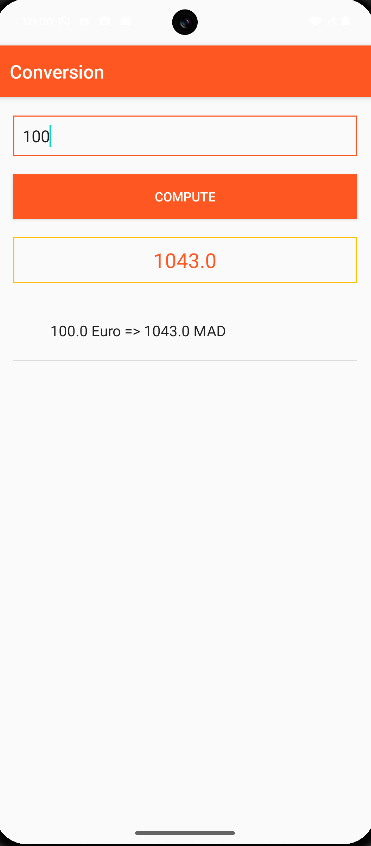

# 💶 Conversion App

## Description
Il s’agit de la première application Android développée dans le cadre du module **Développement Mobile**.  
Elle permet aux utilisateurs de :

- Saisir un montant en **Euros**
- Le convertir en **Dirhams Marocains** à l’aide d’un taux fixe
- Consulter l’historique des conversions dans une **ListView**

## Technologies utilisées
- **Java**
- **Android SDK**
- **XML Layout** (LinearLayout)
- **Composants Android** : ListView, EditText, TextView, Button

